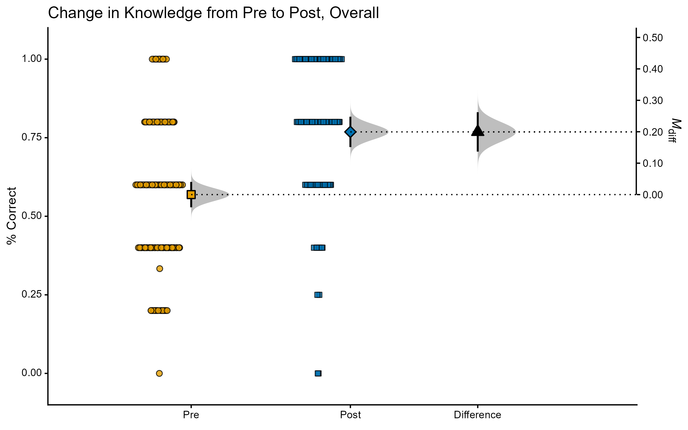
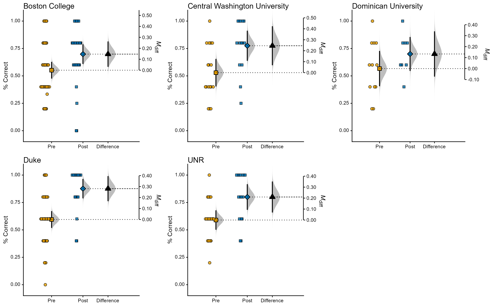
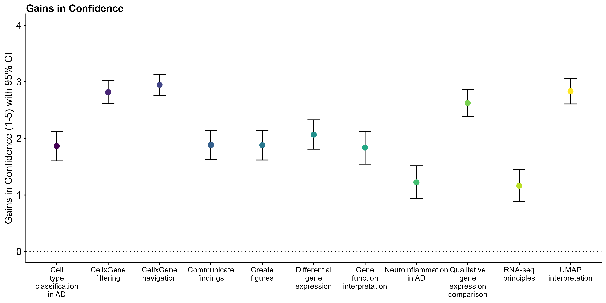
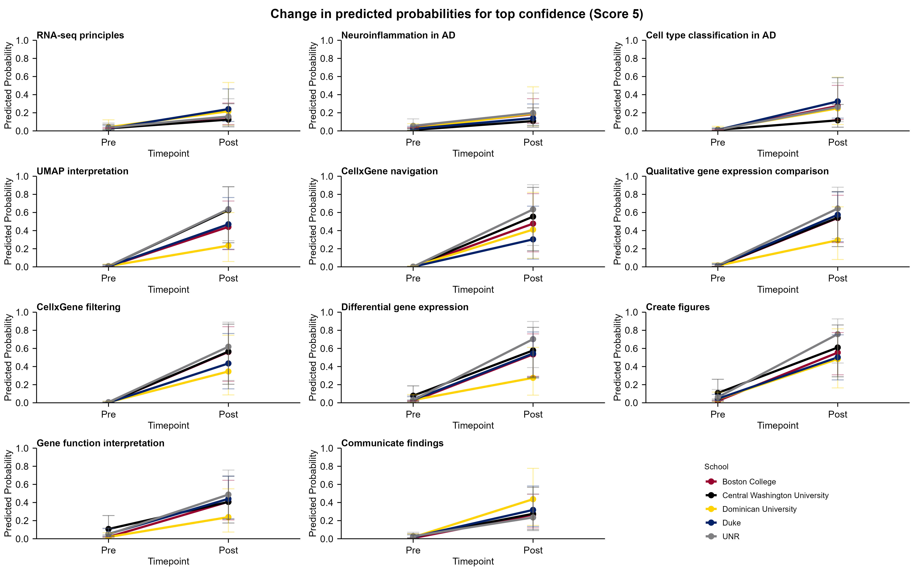
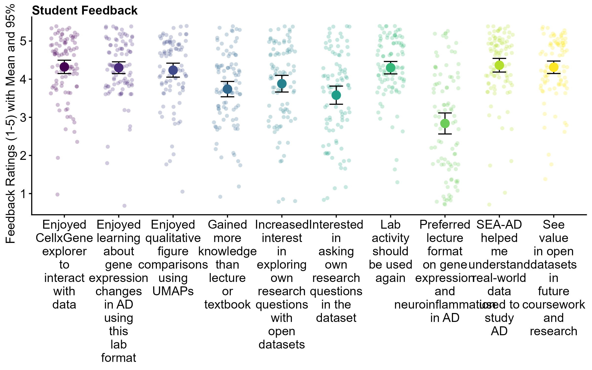

# Assessment data

## Objective Knowledge

Students completed short, multiple-choice measures of objective knowledge before the pre-lab and at the end of the complete lab. Items on the objective knowledge test were matched to learning objectives and skills for the activity (items are listed below).

Examining scores overall showed large gains in knowledge related to the learning objectives:

{width="831"}

| Effect   | Effect Size | LL   | UL   | SE   | N   |
|----------|-------------|------|------|------|-----|
| Post     | 0.76        | 0.72 | 0.81 | 0.02 | 130 |
| Pre      | 0.56        | 0.52 | 0.60 | 0.02 | 91  |
| Post-Pre | 0.19        | 0.13 | 0.26 | 0.03 |     |

In standardized terms: *d*~unbiased~ = 0.85 95% CI \[0.57, 1.13\]

Breaking this down by school shows some diversity in student learning, with students completing the activity in an online setting (Dominican University) showing the smallest gains:

{width="1062"}

## Confidence Ratings

Students rated their confidence on knowledge and skills related to the activity both before the pre-lab and after completing the lab. Confidence was rated on a scale from 1-5. Self-reported learning gains have poor validity, but we did not very large increases in student confidence for knowledge and skills related to the activity.

{width="1063"}

| Confidence item                        | effect_size |   LL |   UL |   SE |     df |
|:--------------------|----------:|----------:|----------:|----------:|----------:|
| RNA-seq principles                     |        1.16 | 0.88 | 1.44 | 0.14 | 222.79 |
| Neuroinflammation in AD                |        1.22 | 0.93 | 1.51 | 0.15 | 223.73 |
| Cell type classification in AD         |        1.86 | 1.60 | 2.13 | 0.13 | 216.89 |
| UMAP interpretation                    |        2.83 | 2.61 | 3.06 | 0.11 | 199.15 |
| CellxGene navigation                   |        2.95 | 2.76 | 3.14 | 0.10 | 212.59 |
| Qualitative gene expression comparison |        2.62 | 2.39 | 2.86 | 0.12 | 224.95 |
| CellxGene filtering                    |        2.82 | 2.61 | 3.02 | 0.10 | 217.11 |
| Differential gene expression           |        2.07 | 1.81 | 2.33 | 0.13 | 222.93 |
| Create figures                         |        1.88 | 1.62 | 2.14 | 0.13 | 211.24 |
| Gene function interpretation           |        1.84 | 1.54 | 2.13 | 0.15 | 226.00 |
| Communicate findings                   |        1.88 | 1.63 | 2.14 | 0.13 | 225.21 |

Breaking this down by school showed roughly similar levels of confidence gains across contexts:

{width="931"}

## Feedback

Finally, students gave feedback on different aspects of the activity (1-5 rating scale):

{width="996"}

# Learning Goals and Skills

Below are the learning goals/skills we defined for the activity and a set of assessment items that can be used to evaluate them. The assessment items are in three types: confidence ratings, feedback on the activity, and objective knowledge.

## [Content:]{.underline}

1.  Explain the principles of RNA-seq, including how transcriptomic data is generated and what it represents at the single-cell level.

2.  Describe the role of neuroinflammation in Alzheimer’s Disease.

3.  Describe how RNA-seq data is used to identify and classify cell types, especially in the context of neurodegenerative disease like Alzheimer’s.

4.  Interpret the purpose and function of UMAP (Uniform Manifold Approximation and Projection) as a dimensionality reduction tool for transcriptomic data.

## [Skills:]{.underline}

5.  Use the Cell×Gene explorer to navigate and interact with SEA-AD single-cell RNA-seq datasets.

6.  Perform qualitative comparisons of gene expression levels across cell types and/or brain regions using UMAP plots.

7.  Filter cells within Cell×Gene explorer based on gene expression, biomarker presence, and demographic variables (e.g., age, sex, pathology score).

8.  Identify differentially expressed genes by comparing groups of interest (e.g., disease state or sex).

9.  Create a qualitative figure that demonstrates changes in gene expression across a group of interest.

10. Interpret the biological function of a gene by using external tools such as the NIH Gene database (GeneCards, NCBI Gene, etc.).

11. Communicate transcriptomic findings through figures (e.g., UMAPs) and summaries that integrate data interpretation with background literature.

# Self-reported Assessment Items

## *Condifence Ratings; Can use Pre & Post*

On a scale of Strongly Agree, Agree, Neither Agree Nor Disagree, Disagree, Strongly Disagree

I feel confident in my ability to:

1.  Explain the principles of RNA-seq, including how transcriptomic data is generated and what it represents at the single-cell level.

2.  Describe the role of neuroinflammation in Alzheimer’s Disease.

3.  Describe how RNA-seq data is used to identify and classify cell types, especially in the context of neurodegenerative disease like Alzheimer’s.

4.  Interpret the purpose and function of UMAP (Uniform Manifold Approximation and Projection) as a dimensionality reduction tool for transcriptomic data.

5.  Use the Cell×Gene explorer to navigate and interact with SEA-AD single-cell RNA-seq datasets.

6.  Perform qualitative comparisons of gene expression levels across cell types and/or brain regions using UMAP plots.

7.  Filter cells within Cell×Gene explorer based on gene expression, biomarker presence, and demographic variables (e.g., age, sex, pathology score).

8.  Identify differentially expressed genes by comparing groups of interest (e.g., disease state or sex).

9.  Create a qualitative figure that demonstrates changes in gene expression across a group of interest.

10. Interpret the biological function of a gene by using external tools such as the NIH Gene database (GeneCards, NCBI Gene, etc.).

11. Communicate transcriptomic findings through figures (e.g., UMAPs) and summaries that integrate data interpretation with background literature.

## Feedback, Post Only

On a scale of Strongly Agree, Agree, Neither Agree Nor Disagree, Disagree, Strongly Disagree

1.  I enjoyed learning about gene expression changes and neuroinflammation in Alzheimer’s Disease in this laboratory format.

2.  I would have preferred a lecture about gene expression changes and neuroinflammation in Alzheimer’s Disease rather than reading and working through this laboratory assignment.

3.  I gained more knowledge about gene expression changes and neuroinflammation in Alzheimer’s Disease from this laboratory format than what I would have learned from a textbook and lecture.

4.  I enjoyed using the CellxGene explorer to interact with SEA-AD datasets

5.  I enjoyed performing qualitative comparisons of gene expression levels and creating figures using UMAP plots

6.  This laboratory assignment should be used again for students to learn about gene expression changes and neuroinflammation in Alzheimer’s Disease.

7.  Working with the SEA-AD dataset helped me understand how large-scale, real-world data can be used to study Alzheimer’s disease

8.  I am interested in asking my own research questions using the SEA-AD dataset.

9.  This laboratory experience increased my interest in exploring my own research questions with open datasets.

10. I see value in using open datasets like SEA-AD in my future coursework or research.

# Objective Assessment Items

## **Content LO1:**

1.  What does transcriptomic data tell us?

A. the exact age of a cell.

B. the genes a cell expresses and the quantity of each.

C. the DNA sequence of each gene.

D. the amount of protein present in a cell.

2.  How is transcriptomic data generated?

A. Sequencing mRNAs transcripts in a nucleus and counting the number of transcripts\*

B. Purifying the proteins in a cell and separating them by size

C. Extracting the DNA from a cell and sequencing it

D. Expressing foreign genes in a cell and measuring amount of protein produced

## **Content LO2:**

3.  Microglia are thought to contribute to the pathology of Alzheimer’s disease by:

    A. Engulfing healthy neurons

    B. Producing amyloid plaques

    C. Promoting neuroinflammation

    D. Creating neurofibrillary tangles

4.  Imagine you are designing a study on neuroinflammation in Alzheimer’s disease using RNA-seq. Why would it be important to compare donors with Alzheimer’s to healthy donors of a similar age?

    A. To ensure that differences in inflammatory gene expression are not simply due to normal aging of the immune system.\
    B. To control for generational or cohort effects that might influence baseline immune gene activity.\
    C. To reduce the influence of other age-related factors, such as changes in microglial activation, that could confound results.\
    D. All of the above.

5.  What is the biological function of the PTPRG gene?

    A. It is a protein found in the cytosol that regulates glycolisis

    B. It is a protein in the endoplasmic reticulum that regulates protein folding

    C. It is a protein phosphotase found int the plasma membrane that has a variety of cellular functions

    D. It is a mitochondrial protein that produces ATP

## **Content LO3:**

5.  In single cell RNA sequencing experiments, how are different cell types classified?

A. Based on protein levels

B. Based on the number of gene mutations detected

C. Based on morphology

D. Based on similar mRNA expression patterns

6.  Which of the following best describes what single-cell RNA-seq data represents?

A. The complete DNA sequence of individual cells, including mutations.

B. The dynamic profile of proteins expressed by a cell at a given time.

C. The relative abundance of transcripts present in a single cell, reflecting gene activity

D. The epigenetic modifications that regulate gene expression in each cell.

## **Content LO3 and/or Skills LO6:**

7.  You are comparing microglial gene expression between Alzheimer’s and normal donors in the SEA-AD dataset. Which result would best suggest disease-specific dysregulation?

A. A gene highly expressed in both AD and normal microglia.

B. A gene showing no difference in expression across cell types.

C. A set of genes consistently upregulated in AD microglia compared to normal microglia.

D. A single transcript detected in only one AD cell but absent in all others.

8.  A student filters SEA-AD microglia for APOE4 carriers vs. non-carriers. Which interpretation would be most biologically sound?

A. APOE4 is irrelevant to gene expression and therefore cannot explain any differences found.

B. Any gene expression changes must reflect APOE4 status directly, regardless of disease condition.

C. All differentially expressed genes are products of single-cell dropout events.

D. Differentially expressed genes may reflect APOE4 associated pathways, but interpretation should consider AD status and other demographic variables.

## **Content LO4:**

9.  In UMAP plots, a cluster represents:

A. A group of genes with similar expression levels

B. A group of cells with similar expression patterns

C. A group of patients with similar phenotypes

D. A group of proteins with similar molecular weights

10. When interpreting differentially expressed genes from CellxGene Explorer, what is the most important consideration?

A. Genes should be interpreted in isolation without reference to biological pathways.

B. Technical confounds such as batch effects and donor demographics can influence results.

C. Every gene identified is biologically relevant and directly contributes to pathology.

D. The number of reads per gene is irrelevant to statistical reliability.

11. Which of the following statements best explains what UMAP, and dimensionality reduction more broadly, is doing?

A. UMAP selects the two most important genes and plots the expression levels of those genes against each other

B. UMAP compresses high-dimensional data into fewer dimensions while preserving as much of the structure of the data (relationships) as possible

C. UMAP discards all but two dimensions of the original dataset, so clusters represent only a small fraction of the biological variability

D. UMAP creates random clusters in 2D space without reference to the high-dimensional input

## **Content LO4 and/or Skills LO9/11:**

12. A well-designed UMAP figure in a report should include:

A. Raw sequencing reads aligned to the genome

B. Clearly labeled axes that represent transcript counts per gene

C. Color-coded clusters or overlays indicating the comparison of interest

D. A bar graph showing the total number of genes expressed in each cell

## **Skills LO5:**

13. In the Seattle Alzheimer’s Brain Cell Atlas (SEA-AD), you can explore:

A. How the abundance of amyloid plaques correlates with cognitive decline

B. The gene mutations associated with Alzheimer’s disease

C. The effectiveness of dementia drugs

D. Gene expression differences between Alzheimer’s and unaffected donors
